# Portraits at the Beebe Backyard Ultramarathon

In November of 2025, I decided to run four miles around the same course, every hour on the hour, until I no longer could. 

I did this as part of the second annual Beebe Backyard Ultra, an informal race pitting participants around Central New York with and against each other to continue running around Cornell's Beebe Lake as long as possible. The rules were as follows: 

- The course is a single loop just short of four miles. Same loop every time.

- Runners begin the loop every hour on the hour. No early starts. 

- Runners must finish each loop within 60 minutes or do not finish (DNF).

- The last runner standing wins.

In addition to running the race myself, I decided to bring a few portable studio strobes to photograph my fellow runners in the short window between finishing my lap of the course and starting the next. 

TODO: lighting kit flick 
Caption: The lights in question, courtesy of the Cornell AAP Equipment Cage. 

Ultramarathons are unique among races in the camaraderie that exists between runners, no matter the stakes of the competition. I think that it stems from a shared decision to do something really stupid. Especially in the backyard format, these races are often 'run' at such slow paces, and over such long times, that casual conversation between runners is almost a requirement. The Beebe Lake Backyard Ultra was no different, and as the hours dragged on, I found myself with more and more friends. 

The race began at 6 AM sharp with the strike of a medium-sized gong.

SRC: 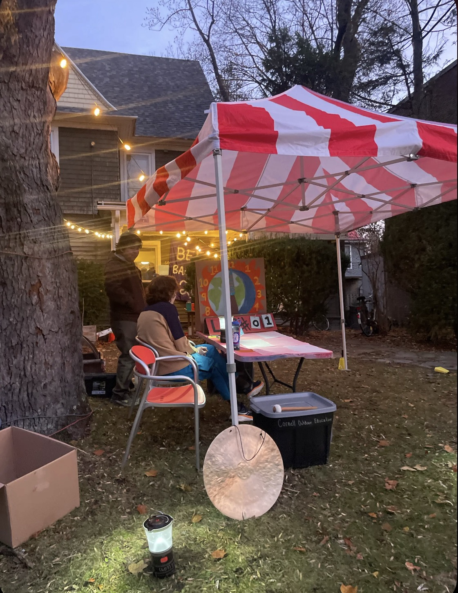
Caption: The admin tent, with gong and mallet ready for the start of the first lap. Image courtesy of Lily Blyn. 

I never ran a lap together with Harshil, a Cornell Law student. However, he was the first one to ask me about why I brought the lighting kit. He sat for the first set of portraits after lap one. Harshil made it 16 laps, just over 100 kilometers. 

SRC: 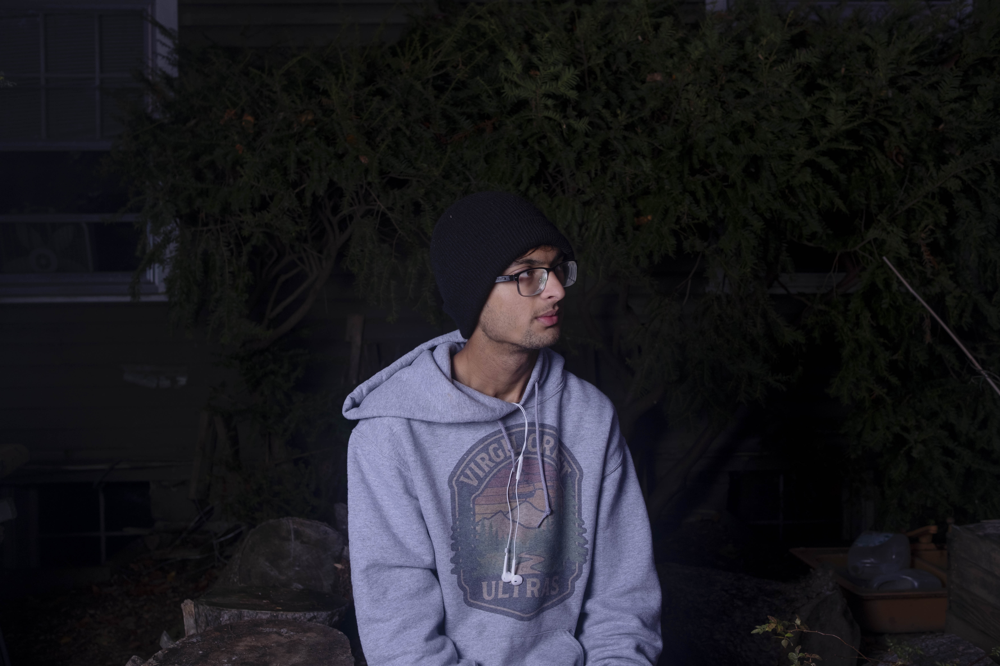 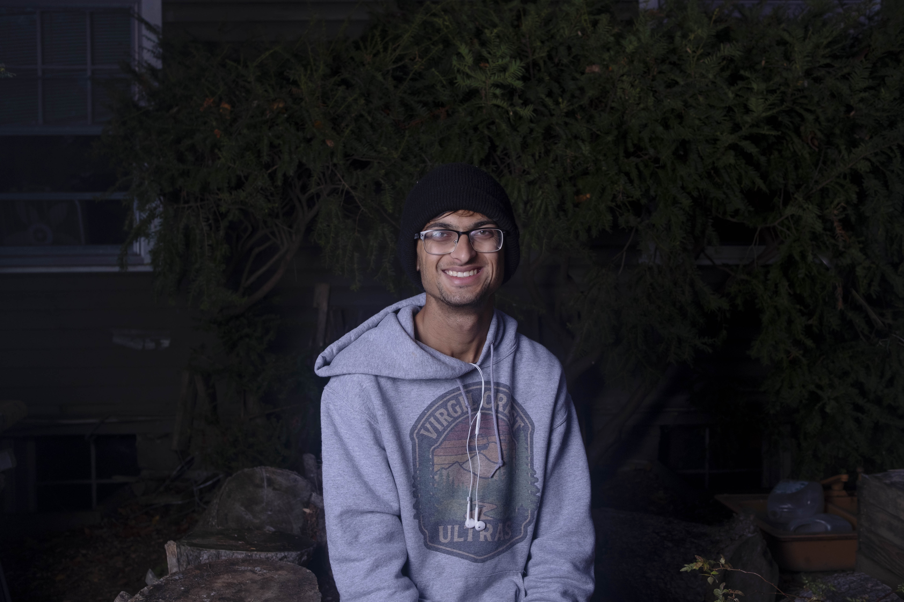
Caption: Harshil at 6:52 AM.

The sun rose at the beginning of the second lap, and I was thankful not only for the light, but for the clear sky. 

SRC: 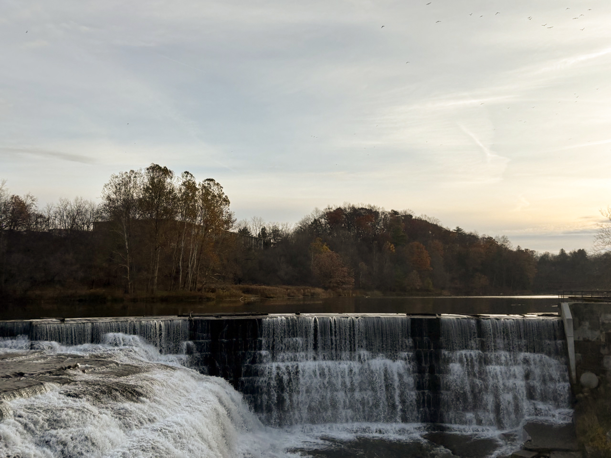
Caption: The sky over the Beebe Dam Bridge at 7:40 AM. 

I ran three laps laps with Amy, the only runner I knew before the race. She was inspired by our friend Laine, who had run 50 miles at a similar event that she had organized the previous week. Amy made it 11 laps. 

SRC:  
Caption: Amy at 7:50 AM.

The second person to ask about my lighting setup was Andrew, the youngest of a family of ultramarathoners from Oneida, New York. I'm not sure how far they all made it in the race, but they were certainly more comfortable than some of us when rain started to fall later in the day. 

SRC: 
Caption: Andrew and family at 9:55 AM. 

Jack is a Cornell undergraduate who I caught in line for the Swedish Fish bowl with a group of his friends and asked if he'd like a portrait. Swedish Fish were one of a few foods that appeared constantly throughout the race, and Jack was thankful for them after the 19 miles he had just run. 

SRC: 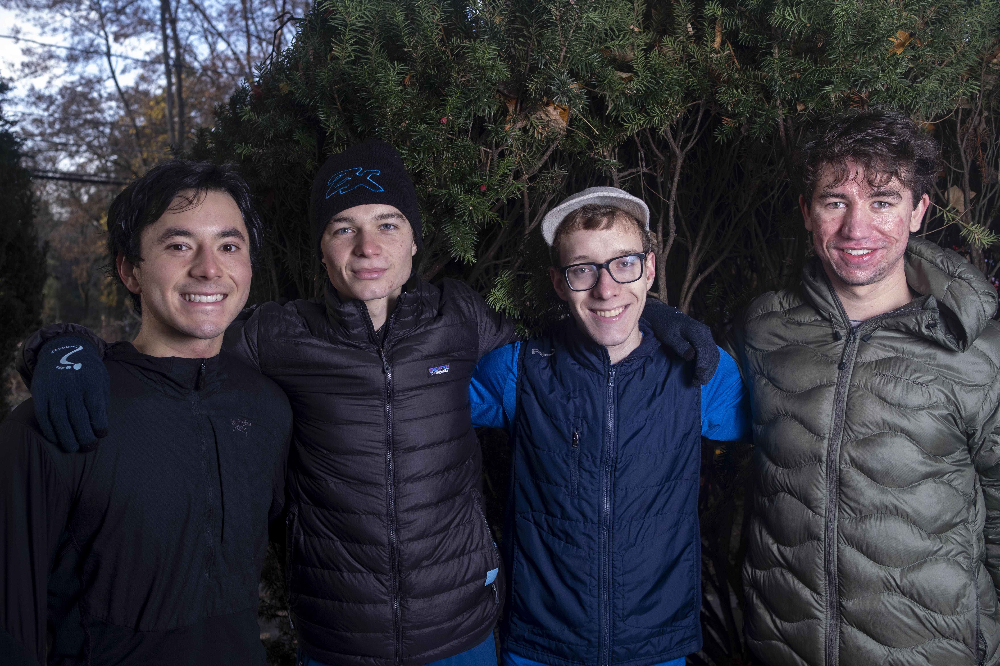
Caption: Jack (far right) and friends at 10:51 AM. 

I caught Johannes, a volunteer firefighter, in line for Gatorade, at the same white folding table as the Swedish Fish. He told his cousin, a hiker and ultramarathoner whose name escapes me, about this race. Johaness' cousin convinced him to run the race with him.

SRC: 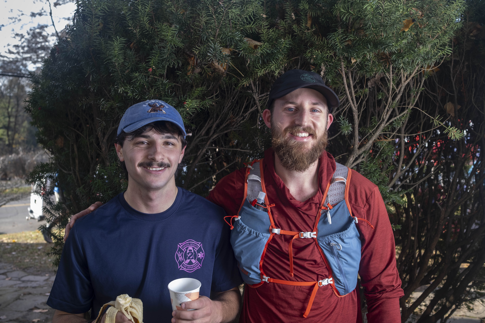
Caption: Johannes (left) and mystery cousin at 10:55 AM. 

Ultramarathons are often called 'the world's fastest eating competition'. In addition to Swedish Fish, rice soup, and Gatorade, the race organizers supplied me with a steady supply of purple salt potatoes. I believe I won the purple salt potato eating competition, if nothing else. 

SRC: 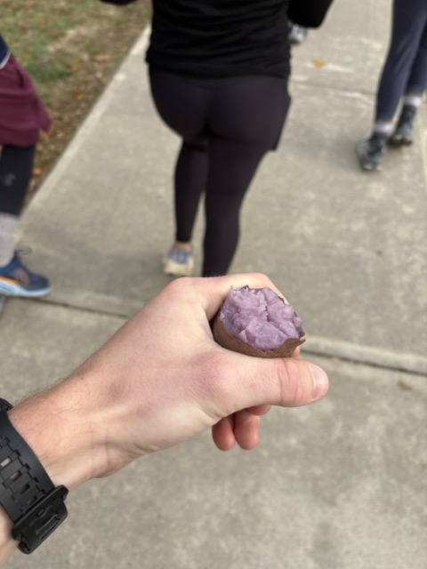
Caption: A purple salt potato, half-eaten at 12:00PM after 24 miles. I finished it just as I passed the Beebe Lake dam. 

I ran with Molly for almost 5 laps. Molly studies biomedical engineering, is a member of Cornell's Nordic Ski team, and is an Ironman. Sophia, who started running at 9:00 AM, found her way into the race through Molly. When I asked them why they decided to run, they shrugged and said 'why not?'. They each made it over 12 laps, sitting some out along the way. They knew that this, along with Sophia's late start, would put them out of the championship running, but to them the race was its own reward. 
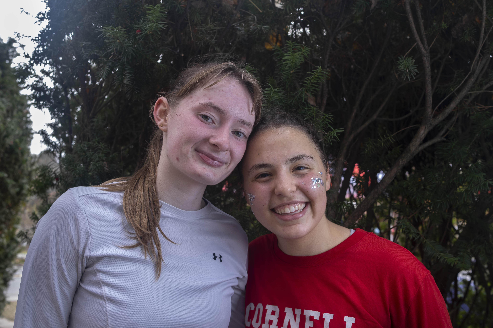
Caption: Molly (left) and Sophia at 11:55 AM. 

I took a photo of myself after making it a marathon, thinking about how there would probably be one or two more marathons before the day was over. You can see it on my face. This was the last photo I took of the day. 

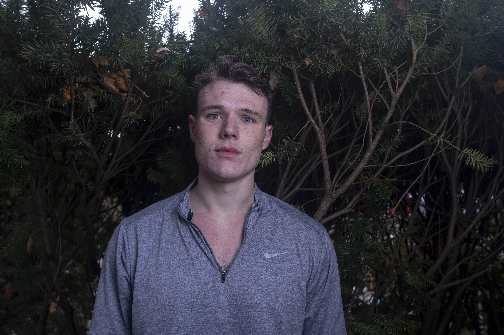 
Caption: Jack at 12:57 PM.

At the beginning of the eighth lap, a group of ominous clouds began to move in over the lake, and rain started at 1:30 PM. It did not stop until the following morning. Whether it was the rain or the beginning of fatigue I could not be sure, but I had to take a few Advil before sitting down after this lap. 

The course began to darken after lap 11, and race organizers passed out headlamps scavenged from Cornell Outdoor Education's supply. I prefer a chest-mounted setup for comfort, which tends to bounce up and down significantly more while running. This visual metronome put me in a trance-like state for most of the night, broken up by my intermittent slips and falls on the muddy grass around Beebe Lake and the Cornell Botanic Gardens arboretum. 

SRC: 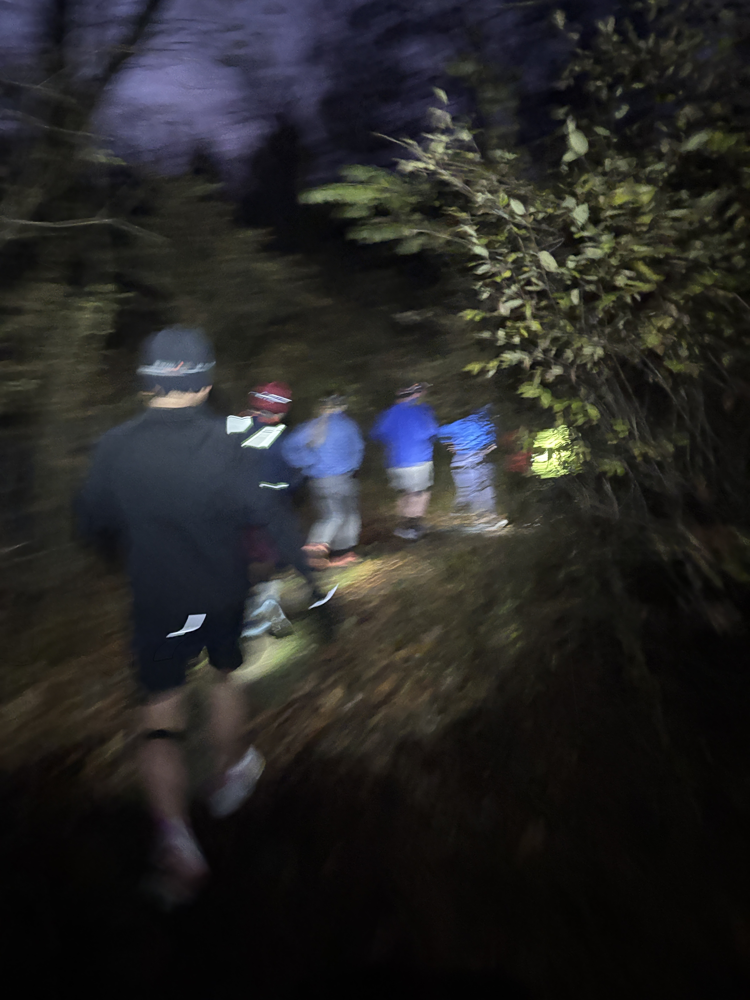
Caption: The first downhill stretch of Monkey Run trail, captured during a brief pause in rain around 7:20 PM. Image courtesy of Ethan Restivo. 

for the next seven hours, I ran with a group of four: Lily, Andrew, and Michael. Due in equal parts to the rain-slicked course and my own fatigue, I did not have the time after any of these laps to set up and take a portrait. The scoreboard, a hand-drawn spreadsheet colored with crayon, was moved to the inside of 504 Thurston Avenue. 

SRC: 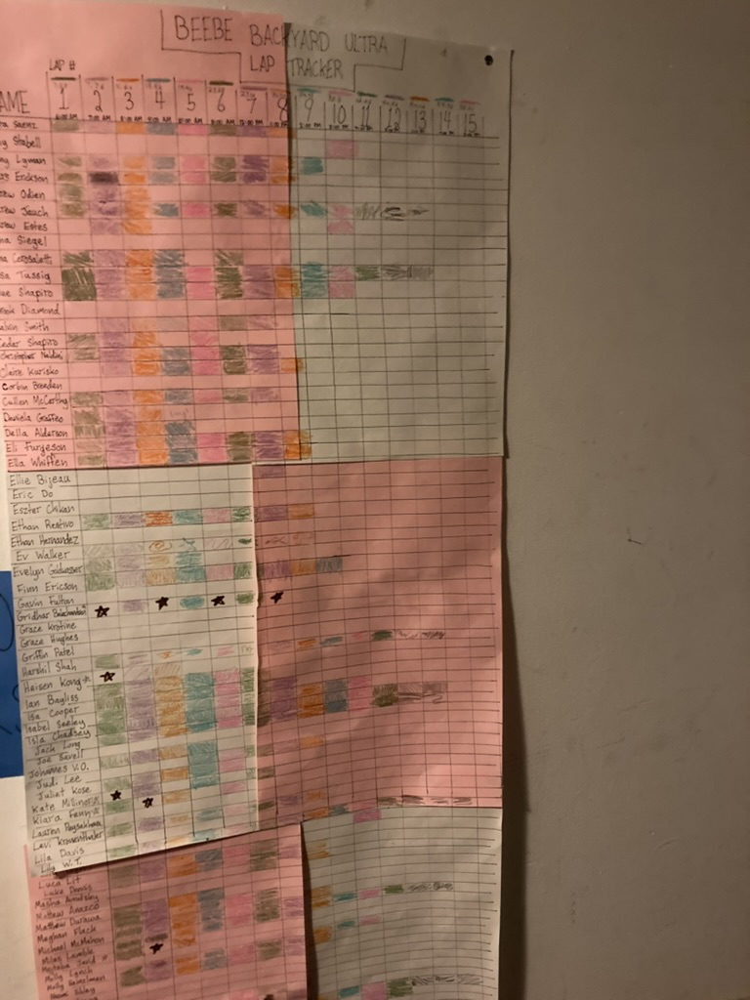
Caption: The scoreboard at 9:00 PM. Image courtesy of Isla Chadsey. 

I dropped out at midnight, after running approximately 65 miles (exactly 2.5 marathons, as I later found out). The Lily, Andrew, and Michael continued on to their 18th lap, and decided to end the race afterwards on a three-way tie. 

